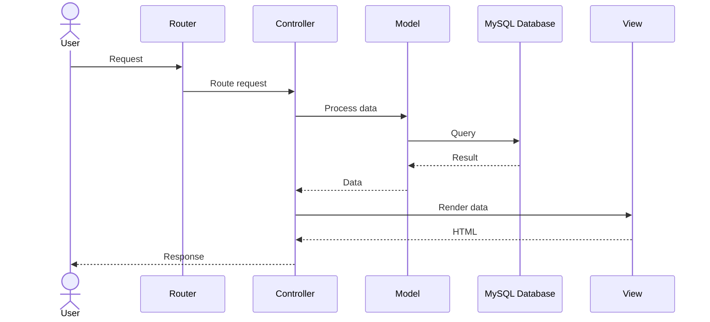
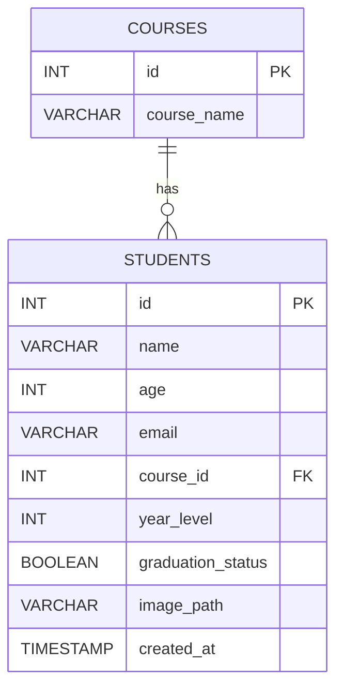

# CMSC 126 Lab 7 - PHP

Demo: [http://andrianllmm.page.gd/](http://andrianllmm.page.gd/)

## Overview

This project is a PHP and MySQL web application implementing a basic CRUD system with file upload functionality.

## Features

- Create, Read, Update, Delete (CRUD)
- Search functionality
- File upload handling (images)
- Relational database with multiple models (students <-> courses)
- Clean and dynamic URL routing (no .php extension)
- Environment variables (.env)
- JavaScript integration
- Tailwind CSS integration

## Architecture Overview

This project follows a minimal MVC-inspired structure.

- **Controllers**: Handles requests and coordinates logic
- **Models**: Handles database queries
- **Views**: Handles UI rendering

### Flow



### Data Model



## Project Structure

```text
cmsc126-lab7-php/
│
├── config/                # Configuration files
│   ├── database.php       # Database connection
│   └── env.php            # .env loader
│
├── controllers/           # Application logic
│   └── StudentController.php
│
├── models/                # Database interaction
│   └── Student.php
│
├── views/                 # UI (HTML + PHP)
│   ├── layout/            # Shared layout (header, footer)
│   ├── components/        # Reusable UI parts (tables, forms)
│   ├── students/          # Student pages (index, create, edit)
│   └── errors/            # Error pages (404)
│
├── index.php              # Front controller + router
│
├── database/              # SQL files
│   ├── schema.sql         # Schema (tables)
│   └── seed.sql           # Dummy data
│
├── uploads/               # Uploaded images
│
├── .env                   # Environment variables
└── README.md
```

Clone the repository:

```bash
git clone https://github.com/andrianllmm/cmsc126-lab7-php.git
cd cmsc126-lab7-php
```

Create environment file:

```bash
cp .env.example .env
```

## Installation

You may choose either Manual Setup (WSL / Linux) or XAMPP.

## Option 1: Manual Setup (WSL / Linux)

### Install PHP + MySQL

Install PHP:

```bash
sudo apt install php php-cli php-mysql
```

PHP installation guide: [https://www.php.net/manual/en/install.php](https://www.php.net/manual/en/install.php)

Install MySQL:

```bash
sudo apt install mysql-server
```

MySQL documentation: [https://dev.mysql.com/doc/](https://dev.mysql.com/doc/)

Start PHP server:

```bash
php -S 0.0.0.0:8000
```

Open in browser:

[http://localhost:8000](http://localhost:8000)

Start MySQL server:

```bash
sudo systemctl start mysql
```

## Option 2: XAMPP Setup

XAMPP provides Apache, PHP, and MySQL in one package.

### Installation steps

1. Download XAMPP
   [https://www.apachefriends.org/index.html](https://www.apachefriends.org/index.html)
2. Install and select Apache + MySQL
3. Start Apache and MySQL via XAMPP Control Panel
4. Place project in `htdocs` folder
5. Open in browser:
   [http://localhost](http://localhost)

XAMPP official documentation: [https://www.apachefriends.org/docs/](https://www.apachefriends.org/docs/)

## Database Setup

### Import schema

Run:

```bash
mysql -u root -p < database/schema.sql
```

Or use phpMyAdmin import.

### Seed database (optional)

To populate sample data:

```bash
mysql -u root -p cmsc126_db < database/seed.sql
```

### Configure environment

Update `.env` file:

```
DB_HOST=127.0.0.1
DB_USER=root
DB_PASS=yourpassword
DB_NAME=cmsc126_db
```
